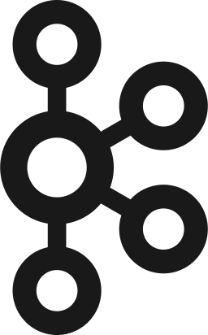

  
<a href="/README_RUS.md">Switch to Russian version</a>

  <h1>Hey there 🤘, I'm Julia!</h1>

  
<!-- Social icons section-->

  

    
    
    
  

  
<i>"Testing everything is not just a job. It is a lifestyle."</i>

<!-- Section about me -->

  <h2>About me</h2>
    

      I'm a passionate QA engineer who loves learning new things 
      💻 8+ years of experience in manual software testing 
      📄 <a href="https://www.gasq.org/en/registration/expert/2d04b0ed-14da-4af1-9282-d778c9054654.html">ISTQB Certified:</a> CTFL, CTAL-TA 
      💙 QA in the bestest team at [OzonTech](https://ozon.tech/) 
      😠Automating tests in C#, testing APIs and enjoying life 
    

<!-- Education section -->

  <table width="100%" border='0'>
    <tr><td width="25%" valign="bottom" align="center"><a href="https://redrover.school/"></td><td valign="middle"><b>Non-Commercial IT School RedRover</b> QA Automation with Java (online course) </td><td>2023</td></tr>
    <tr><td width="25%" valign="bottom" align="center"><a href="https://qa.guru/"></td><td valign="middle"><b>QA Guru</b> QA Automation with Java (online course) </td><td>2022</td></tr>
    <tr><td width="25%" valign="bottom" align="center"><a href="https://english.mirea.ru/"></td><td valign="middle"><b>MIREA - Russian Technological University</b> Institute for Complex Security and Special Instrumentation Software Engineering (Bachelor's Degree)</td><td>2016 - 2020</td></tr>
   <tr><td width="25%" valign="bottom" align="center"></td><td valign="middle"><b>Moscow State Linguistic University</b> Faculty of German Language Linguistics (Bachelor's Degree)</td><td>2012 - 2016</td></tr>
  </table>

<!-- Tech Stack Section -->

  <h2>Tech Stack</h2>
  
  
  
  
  
  
  
  
  
  
  
  

  <h2>Projects</h2>
  <ul>
    <li><a href="https://github.com/judmi/qa-guru-13-3-demoqa">Tiny demo project with auto tests</li>
    <li><a href="https://github.com/judmi/luma">Auto tests for Luma demo site</li>
    <li>Contributing to the <a href="https://github.com/RedRoverSchool">RedRover School</a> projects</li>
    <li><a href="https://github.com/judmi/codewars">Java solutions for Codewars</li>
  </ul>

<!-- Hobbies Section -->

  <h2>Hobbies</h2>
  <ul>
    <li>astronomy 🌠</li>
    <li>electric guitar 🎸</li>
    <li>italian language 🇮🇹</li>
    <li>dog psychology and training 🐕‍🦺</li>
    <li>trying and learning new things 📚</li>
  </ul>

<h2></h2>

